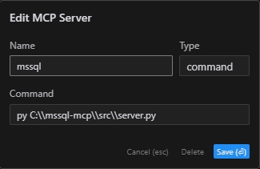

# MSSQL MCP Server

## Overview

MSSQL MCP Server,  provides database interaction and business intelligence capabilities. This server enables running SQL queries, analyzing business data, and automatically generating business insight memos.  
Refer to the official website's SQLite for modifications to adapt to MSSQL

## Components

- `read_query`
   - Execute SELECT queries to read data from the database
- `write_query`
   - Execute INSERT, UPDATE, or DELETE queries
- `create_table`
   - Create new tables in the database
- `list_tables`
   - Get a list of all tables in the database
- `describe-table`
   - View schema information for a specific table
- `append_insight`
   - Add new business insights to the memo resource
   
## Operating environment

- `Python 3.x`
- `Packages`
   - pyodbc>=4.0.39
   - pydantic>=2.0.0
   - mcp>=0.1.0 
- `ODBC Driver 17 for SQL Server`

## Usage 

### Install packages

```bash
CD /d ~/mssql-mcp  
pip install -r requirements.txt  
```

### config

```bash
#with server.py same folder create config.json，add：    
{
    "database": {
        "driver": "ODBC Driver 17 for SQL Server",
        "server": "server ip",
        "database": "db name",
        "username": "username",
        "password": "password",
        "trusted_connection": false
    },
    "server": {
        "name": "mssql-manager",
        "version": "0.1.0",
        "host": "0.0.0.0",
        "port": 8080
    }
}
```

### Claude Desktop 、 Windsurf

```bash
# add to claude_desktop_config.json. Note：use your path  
{
	"mcpServers": {
	  "mssql": {
				"command": "py",
				"args": [
					# your path，e.g.："C:\\mssql-mcp\\src\\server.py"
					"~/server.py"
				]
			}
	}
}
```

### Cursor

```bash
# Add according to the following diagram Cursor MCP. Note：use your path  
```


### MCP Inspector

```bash
# Note：use your path  
npx -y @modelcontextprotocol/inspector py C:\\mssql-mcp\\src\\server.py
```

## License

MIT License
